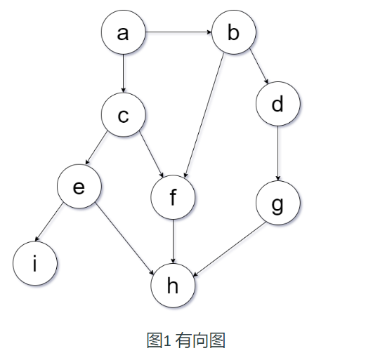
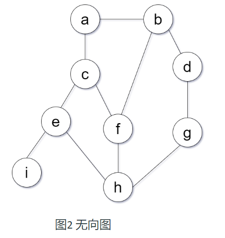
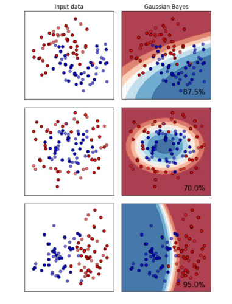

# 第三次作业

截止 2021年10月20日 由 23:59 编辑 得分 0 提交 一份上传文件

一、某地成年人肥胖者()占10%,中等者()占82%,瘦小者()占8%,又肥胖者，中等者，瘦小者高血压病的概率分别为20%,10%,5%.

(1).求该地成年人患高血压的概率.

(2).若知某人患高血压，他最可能属于哪种体型？

 

二、如教材3.54式和3.56式，分别写出如下有向图和无向图对应的概率分布.

 

三、取值为0,1,2,3,4,5的概率分别为1/2,1/4,1/8,1/16,1/32,1/32。求其香农熵.

 

四、叙述KL散度和交叉熵定义，并给出自己的理解

 

五、机器学习初识：学习sklearn中的朴素贝叶斯

Sklearn为我们提供了这几种朴素贝叶斯的分类器：

naive_bayes.GaussianNB

naive_bayes.BernoulliNB

naive_bayes.MultinomialNB

naive_bayes.ComplementNB

1、说明每种分类器的含义以及区别

2、利用sklearning自带的数据集：(from sklearn.datasets import make_moons, make_circles, make_classification), 自行划分训练集和测试集(无需验证集)，使用第一种分类器(naive_bayes.GaussianNB)，并且可视化结果，说明在不同数据类型下分类器效果的差别。

举例效果如下：

NOTE: 不必一模一样的格式展示出如上结果，可视化分类器结果即可，重点分析区别